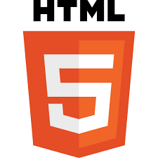

Headers

# H1 HELLO THERE!

## This HTML site was created using a simple commonmark or markdown language (read more about it on the repo).

###### Produced and put together by Skauvik & Hjerding productions (C)SkauvikPROD _author: Sigurd Skauvik_
The todo list for tomorrow is

* Go through bashcontrol repository and read up on printf further read up on taking input from the commandline.
* Second is to make the B-REAL channel or find atleast likeminded to just chat with. Simply just chat about common interests.

This is important tasks:

1. Read the message from doctor!
2. Important phonecall at 11.
3. Visit pal at 12.

---

## This part is markdown in action, just examples and stuff to play around with!

**Bold text are the same in markup as in what Discord cals Markup**
_Different formatting is easy, much much easier than programming a HTML page_

*Hello there!* 
_italics_ My name is Sigurd Skauvik

Here is a link to my temporary business model template. [Temporary template site for skauvik company](http://skauvikprod.godaddysites.com).  
 
Inline <pre> This is a little text that uses HTML syntax inside of this markdown document. It is supported.</pre>
